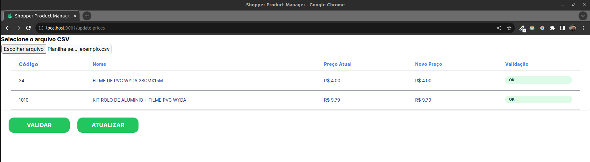

# product-management
This is is Full Stack project for managing the price of the products from a shop

## How to run:
###### npm version used: 8.15.0

#### step 01: Clone the repository to your computer
```
git clone git@github.com:leonanm03/product-management.git
 ```
#### step 02: Enter in "api" directory of the repository and install dependencies
```
cd product-management/api/
 ```
```
npm install
 ```
#### step 03: Copy ".env.example" file to a ".env" file
```
cp .env.example .env
 ```
Edit .env for matching with your setup, as default it comes like this:
```
MYSQL_ROOT_USER=root                    # your mysql user
MYSQL_ROOT_PASSWORD=root                # your mysql password
MYSQL_DATABASE=shopper                  # database name
MYSQL_PORT=3306                         # your mysql port
MYSQL_HOST=localhost                    # your mysql address
FRONTEND_URL=http://localhost:3001      # the address where your web page will be runing
```
#### step 04: Create your database with tables
```
npm run migrate:deploy
 ```
#### step 05: Generate prisma models
```
npm run prisma:generate
 ```
#### step 06: Seed your database
```
npm run prisma:seed
 ```
#### step 07: Let api run
```
npm run start:dev
 ```
#### step 08: Enter in "web" directory of the repository and install dependencies
```
cd ../web/
 ```
```
npm install
 ```
#### step 09: Copy ".env.example" file to a ".env" file
```
cp .env.example .env
 ```
Edit .env for matching with your setup, as default it comes like this:
```
NEXT_PUBLIC_API_URL=http://localhost:3000      # the address where your api will be ruining
```
#### step 10: Start your web application
```
npm run dev
 ```


Now, in you browser, you may enter in the /update-prices route and use the application.

